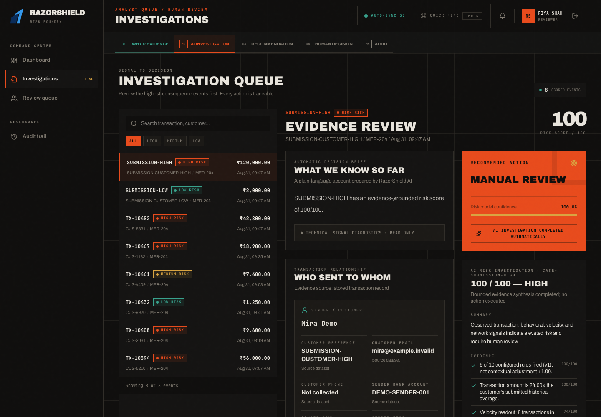
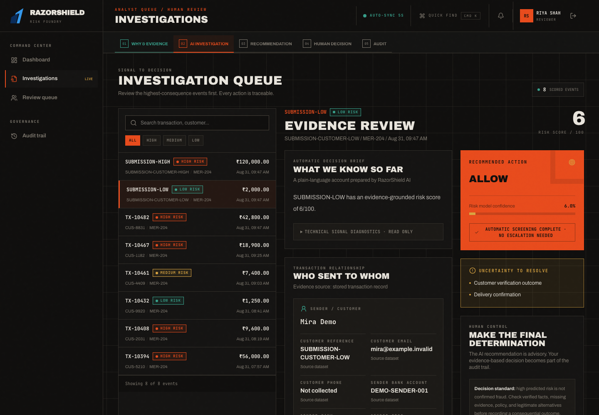
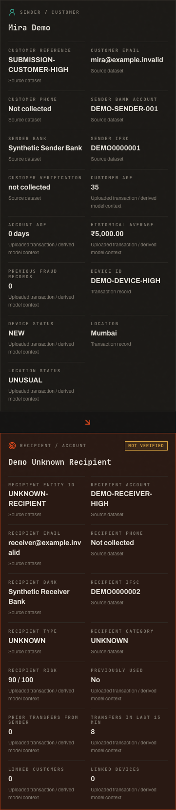
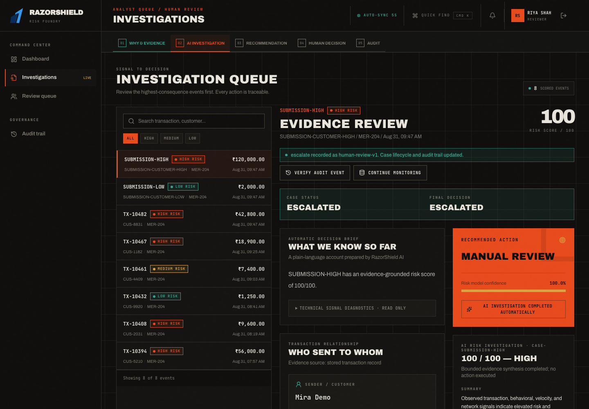
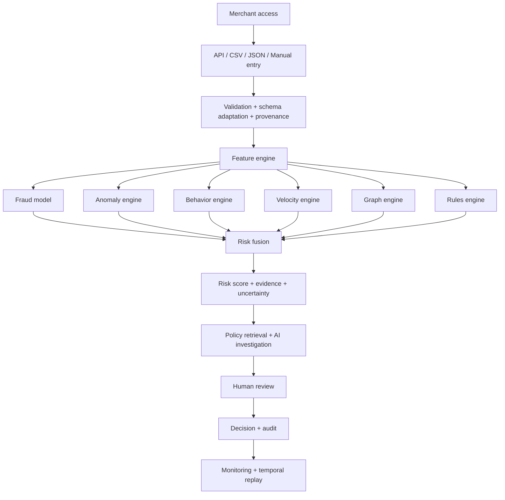

# RazorShield AI

### Explainable Merchant Risk Operations

> A defense-only AI risk manager that combines transaction context, multiple risk engines, policy evidence, human review, and a complete audit trail.

**Razorpay AI Buildathon · Track 02 — AI Risk Manager**

[](https://github.com/Dhanush-245/RazorShield-AI-Risk-Manager/actions/workflows/ci.yml) · **Synthetic demo data** · **Held-out evaluation** · **Human decisions** · **Financial execution disabled**

[](https://youtu.be/rLeFfWaX6cE)

[▶ Watch the Buildathon Demo](https://youtu.be/rLeFfWaX6cE) · [⚡ Judge in 3 Minutes](#judge-razorshield-in-3-minutes) · [Explore the Screenshots](#inside-the-workflow) · [Verified Evaluation](#verified-model-evaluation) · [Architecture](docs/ARCHITECTURE.md) · [Run Locally](#run-locally)

**RazorShield AI** turns a risk score into an investigation a merchant can understand, challenge, review, and audit.

> [!IMPORTANT]
> RazorShield is a competition-ready local demonstration, not a certified production fraud control. Bundled operational data and deployed contextual models are synthetic. A high score is evidence for review—not proof of fraud—and the AI investigator cannot block payments, move money, issue refunds, contact customers, or submit chargebacks.

## Why RazorShield?

A high-value transaction is not automatically fraudulent. Risk needs context.

Most fraud demos stop at a probability. RazorShield continues through the decision: **what changed, why it matters, what evidence supports or contradicts the assessment, which policy applies, who made the final decision, and whether that decision can be reconstructed later.**

> **The model ranks risk. Evidence explains it. A human decides. The audit trail remembers.**

### Judge RazorShield in 3 Minutes

This is a fast inspection route, not a substitute for the full narrated pitch:

1. **See the product (0:00–0:30):** inspect the [risk dashboard](docs/submission/screenshots/dashboard.png) and active-dataset command center.
2. **Compare two decisions (0:30–1:15):** open the [high-risk case](docs/submission/screenshots/high-risk.png), then the [low-risk education payment](docs/submission/screenshots/low-risk.png).
3. **Check the evidence (1:15–2:00):** inspect [sender/receiver details](docs/submission/screenshots/sender-receiver.png), behavioral history, risk contributions, and counterfactual analysis.
4. **Check human control (2:00–2:30):** review the [investigation](docs/submission/screenshots/investigation.png), [human decision](docs/submission/screenshots/human-decision.png), and [audit event](docs/submission/screenshots/audit.png).
5. **Verify, do not infer (2:30–3:00):** read the [evaluation](docs/EVALUATION.md), [claim-to-evidence table](#claim--evidence), [security boundary](#safety-security-and-limitations), and [CI workflow](https://github.com/Dhanush-245/RazorShield-AI-Risk-Manager/actions/workflows/ci.yml).

For the complete submission route, use the [submission checklist](docs/submission/README.md), [five-minute narration](docs/submission/FINAL_1080P_NARRATION.md), and [application answer sheet](docs/submission/APPLICATION_ANSWERS.md).

## Demo

[](https://youtu.be/rLeFfWaX6cE)

**Narrated Razorpay AI Buildathon walkthrough.** [Watch the demo on YouTube →](https://youtu.be/rLeFfWaX6cE)

The recording demonstrates the local, synthetic-data workflow: authentication, dashboard, contextual transaction scoring, evidence, counterfactual analysis, bounded AI investigation, human review, audit, and measured model evaluation. It does not show or claim live financial execution.

## Inside the Workflow

<table>
<tr>
<td width="50%"><a href="docs/submission/screenshots/high-risk.png"></a><br><strong>Explain the risk.</strong> A suspicious transaction is supported by velocity, device, recipient, location, and historical-behavior evidence.</td>
<td width="50%"><a href="docs/submission/screenshots/low-risk.png"></a><br><strong>Recognize legitimate context.</strong> A high-value education payment can remain low risk when prior behavior and recipient context support it.</td>
</tr>
<tr>
<td width="50%"><a href="docs/submission/screenshots/sender-receiver.png"></a><br><strong>Show who sent to whom.</strong> Party, account, bank, verification, device, and location fields remain visible to the human reviewer.</td>
<td width="50%"><a href="docs/submission/screenshots/human-decision.png"></a><br><strong>Keep authority human.</strong> The system recommends; an authorized reviewer approves, rejects, escalates, or requests more evidence.</td>
</tr>
</table>

Open any image for full-resolution detail. All names, account references, events, and case stories in the bundled demonstration are fictional and deterministic.

## Intelligence That Follows the Decision

| Question                       | RazorShield capability                                                                   |
| ------------------------------ | ---------------------------------------------------------------------------------------- |
| What is happening?             | Merchant dashboard, transaction ledger, active-dataset analytics, and spike monitoring   |
| What is dangerous?             | Fraud, anomaly, behavior, velocity, graph, and configurable rule engines                 |
| Why is it risky?               | Structured contributions, observed evidence, behavioral history, and party relationships |
| What would change the result?  | Read-only counterfactual simulator using the real scoring path                           |
| Which policy applies?          | Merchant-scoped lexical policy retrieval with source evidence                            |
| What should happen next?       | Evidence-bound AI investigation and a bounded recommendation                             |
| Who decides?                   | Role-based human review with mandatory notes for consequential actions                   |
| Can the decision be defended?  | Case timeline, decision receipt, and immutable audit events                              |
| Is the model still healthy?    | Model monitoring, drift status, temporal replay, and fraud-spike detection               |
| Can the team afford the queue? | Threshold, false-positive cost, missed-fraud cost, and review-capacity simulation        |

## Architecture



Risk-relevant historical, velocity, graph, and recipient features are recomputed from trusted prior records when possible. Merchant-supplied derived assertions pass through a raise-only gate: they may increase scrutiny but cannot suppress platform-observed risk. Read the [trust-boundary design](docs/TRUST_BOUNDARY_AND_REPLAY.md) and [technical architecture](docs/ARCHITECTURE.md).

## Two Transactions, Two Different Outcomes

**Deterministic synthetic demo scenarios—not production evaluation examples.**

| Suspicious transaction                                                                          | Verified education payment                                                               |
| ----------------------------------------------------------------------------------------------- | ---------------------------------------------------------------------------------------- |
| **98/100 · HIGH · MANUAL REVIEW**                                                               | **5/100 · LOW**                                                                          |
| Elevated velocity, new device, risky recipient context, location deviation, and behavior change | High amount, but expected category, established context, and trusted behavioral evidence |
| Counterfactual example: normalizing velocity reduces the frozen assessment to **82**            | Demonstrates that `amount > ₹100,000` does not automatically mean fraud                  |

The counterfactual simulator is exploratory and does not save a new transaction, alter the deployed threshold, or claim causality. Exact demo outputs are asserted by the recording rehearsal; model-evaluation metrics are reported separately below.

## Verified Model Evaluation

### Synthetic contextual fusion

**60,000 chronological synthetic rows · 36,000 train · 12,000 validation · 12,000 locked test**

### IEEE-CIS candidate

**413,378 train · 44,290 calibration · 44,291 selection · 88,581 locked test**

| Metric              |       Synthetic fusion v3 |          IEEE-CIS v2 candidate |
| ------------------- | ------------------------: | -----------------------------: |
| Precision           |                    36.23% |                         50.38% |
| Recall              |                    52.22% |                         52.22% |
| F1                  |                    42.78% |                         51.28% |
| PR-AUC              |                    41.18% |                         53.62% |
| ROC-AUC             |                    81.35% |                         90.90% |
| False-positive rate |                     9.95% |                          1.86% |
| TN / FP / FN / TP   | 9,751 / 1,077 / 560 / 612 | 83,912 / 1,586 / 1,473 / 1,610 |

These are frozen-estimator holdout results, not measured merchant production performance. The populations and schemas differ, so the two columns are not a head-to-head comparison. Neither model meets the requested **80% precision / 85% recall** production gate. The IEEE-CIS model remains `CANDIDATE_REJECTED_BY_GOVERNANCE` and is not the ordinary merchant API model.

RazorShield also reports the operational trade-off. At the configured illustrative costs—₹100 per false alert, ₹5,000 per missed fraud, and ₹50 per review—the lowest modeled-cost policy may exceed analyst capacity. These are assumptions, not realized savings.

[Full evaluation and cost tables](docs/EVALUATION.md) · [Model card](docs/MODEL_CARD.md) · [Promotion decision](docs/DEPLOYMENT_READINESS.md) · [Frozen replay evidence](docs/verification/submission-metrics-2026-08-31.json)

Replay the checked-in artifacts without fitting or promoting a model:

```bash
PYTHONPATH=backend:. backend/.venv/bin/python \
  scripts/verify_submission_metrics.py \
  --output outputs/submission/metrics.json
```

## Claim → Evidence

| Claim                                                                                      | Verify it                                                                                                                                              |
| ------------------------------------------------------------------------------------------ | ------------------------------------------------------------------------------------------------------------------------------------------------------ |
| Locked chronological evaluation and confusion matrices                                     | [Evaluation report](docs/EVALUATION.md) · [aggregate replay](docs/verification/submission-metrics-2026-08-31.json)                                     |
| Contextual explanations are structured contributions, not SHAP                             | [Evaluation limitations](docs/EVALUATION.md) · [model card](docs/MODEL_CARD.md)                                                                        |
| Optional IEEE explanations reconstruct the calibrated probability                          | [IEEE risk tests](backend/tests/test_ieee_cis_risk.py) · [candidate audit tests](ml/tests/test_ieee_cis_audit.py)                                      |
| Risk-relevant derived inputs respect provenance and prior-only context                     | [Trust-boundary design](docs/TRUST_BOUNDARY_AND_REPLAY.md) · [golden transaction tests](backend/tests/test_golden_transactions.py)                     |
| AI investigation is bounded and cannot execute financial actions                           | [Agent policy](docs/AGENT_POLICY.md) · [policy retrieval tests](backend/tests/test_policy_retrieval.py)                                                |
| Human decisions, timelines, and audit events are persisted                                 | [Case-management tests](backend/tests/test_risk_workbench.py) · [browser journey](artifacts/razorshield-ai/e2e/risk-journey.spec.ts)                   |
| Fresh and existing PostgreSQL migration paths cover `user_role` safely                     | [Migration regression](backend/tests/test_postgresql_migrations.py) · [verification report](docs/verification/postgresql-enum-migration-2026-08-31.md) |
| RBAC, tenant isolation, rate limits, headers, validation, and fail-closed paths are tested | [Security tests](backend/tests/test_security.py) · [security checklist](docs/SECURITY_CHECKLIST_2026-08-29.md)                                         |
| 10/100/1,000 transaction load stages were measured                                         | [Load-test evidence](docs/verification/load-test-2026-08-28.json)                                                                                      |
| CI checks backend, ML, PostgreSQL, browser E2E, dependencies, and containers               | [Workflow](.github/workflows/ci.yml) · [submission validation](docs/verification/submission-validation-2026-08-31.md)                                  |

Passing tests and scans are point-in-time evidence, not a security certification or production approval.

## Run Locally

**Python 3.12 recommended (3.11+ supported) · Node.js 22+ · pnpm 10+ · Git**

```bash
git clone https://github.com/Dhanush-245/RazorShield-AI-Risk-Manager.git
cd RazorShield-AI-Risk-Manager

cp .env.example backend/.env
python3 -m venv backend/.venv
backend/.venv/bin/python -m pip install -e './backend[dev]'
pnpm install --frozen-lockfile

cd backend
.venv/bin/python -m alembic upgrade head
.venv/bin/python -m uvicorn app.main:app --reload --port 5001
```

In a second terminal, from the repository root:

```bash
pnpm --filter @workspace/razorshield-ai dev
```

Open `http://localhost:5173`. Development API documentation is available at `http://localhost:5001/docs`.

### Local demonstration accounts

| Role         | Email                       | Password                     | Access                                                  |
| ------------ | --------------------------- | ---------------------------- | ------------------------------------------------------- |
| Admin        | `admin@razorshield.demo`    | `Admin-RazorShield-2026!`    | Full local-demo administration                          |
| Risk analyst | `analyst@razorshield.demo`  | `Analyst-RazorShield-2026!`  | Transactions, assessments, and investigations           |
| Reviewer     | `reviewer@razorshield.demo` | `Reviewer-RazorShield-2026!` | Review, approve, reject, escalate, and request evidence |
| Viewer       | `viewer@razorshield.demo`   | `Viewer-RazorShield-2026!`   | Read-only analytics and monitoring                      |

These credentials are intentionally public for the local demonstration only. Never deploy these accounts or demo secrets to a public environment.

## Use the Application

### Assess a transaction

Sign in, open **Assess transaction**, enter or select a transaction, and choose **Assess risk**. The result includes:

- final score, band, and bounded recommendation;
- fraud, anomaly, behavior, velocity, graph, and rule signals;
- evidence and trust context;
- sender and receiver details;
- uncertainty and explanation limitations;
- an investigation action for human review.

Authenticated integrations can use `POST /api/v1/risk/assess`. See the [API reference](docs/API.md) for contracts and examples.

### Upload a dataset

The Dataset Analysis workspace accepts CSV or JSON uploads up to **5,000 rows or 25 MB**. The adapter maps common column names into RazorShield's canonical schema, reports mappings and missing fields, and activates a successful dataset atomically across operational screens. Uploading never retrains a model automatically.

Use [examples/transactions.csv](examples/transactions.csv) for a standard import or [examples/complete-party-details.csv](examples/complete-party-details.csv) for 48-column sender/receiver coverage. The latter contains 24 fully synthetic records and is for workflow verification—not model training or performance claims.

### Investigate and review

Open a case to inspect the transaction timeline, prior-only behavioral fingerprint, relationship evidence, policy matches, AI-generated decision brief, counterfactuals, and human-versus-model feedback. Consequential actions remain behind role checks and produce an audit event.

## Docker

The Compose stack is a local development environment with public demo database credentials, not a production deployment.

```bash
docker compose up --build
```

Open the UI at `http://localhost:5173`; API documentation is at `http://localhost:8000/docs` for the Compose environment.

Production requires managed secrets, HTTPS, explicit CORS origins, disabled demo seeding, a managed PostgreSQL/Redis deployment, backup/restore validation, observability, and an infrastructure security review.

## Run Tests and Checks

```bash
backend/.venv/bin/ruff format --check backend ml scripts/load_test.py
backend/.venv/bin/ruff check backend ml scripts/load_test.py
PYTHONPATH=backend:. backend/.venv/bin/python -m pytest backend/tests ml/tests
backend/.venv/bin/python -m pip_audit --skip-editable

pnpm run typecheck:libs
pnpm --filter @workspace/razorshield-ai typecheck
pnpm --filter @workspace/razorshield-ai build
pnpm audit --prod --audit-level high

RAZORSHIELD_E2E_UI_PORT=5175 \
RAZORSHIELD_E2E_API_PORT=5003 \
pnpm --filter @workspace/razorshield-ai e2e
```

Browser tests use an isolated UUID-named SQLite database and do not reuse the merchant's running server. For PostgreSQL migration regressions, set `RAZORSHIELD_POSTGRES_TEST_URL` to a disposable PostgreSQL cluster with `CREATEDB` permission. GitHub Actions additionally provisions PostgreSQL 16 and verifies the complete Alembic chain, browser E2E, dependency audits, and Docker builds.

## Reproduce the Native 1080p Demo

The recording flow is opt-in, uses an isolated database, and does not change ML artifacts or an existing merchant workspace. Supply an absolute path to a local synthetic CSV containing exactly 1,000 rows.

```bash
RAZORSHIELD_RECORD_RECRUITER_PITCH=1 \
RAZORSHIELD_RECRUITER_PITCH_PACED=1 \
RAZORSHIELD_E2E_RECORD=1 \
RAZORSHIELD_E2E_VIDEO_WIDTH=1920 \
RAZORSHIELD_E2E_VIDEO_HEIGHT=1080 \
RAZORSHIELD_E2E_CHANNEL=chrome \
RAZORSHIELD_E2E_UI_PORT=5175 \
RAZORSHIELD_E2E_API_PORT=5003 \
RAZORSHIELD_RECRUITER_DATASET=/absolute/path/to/transactions.csv \
pnpm --filter @workspace/razorshield-ai exec playwright test \
  e2e/recruiter-pitch.spec.ts --project=chromium
```

Build the approved five-minute timeline and add local synthetic narration:

```bash
python3 scripts/build_recruiter_video_1080p.py \
  --recording artifacts/razorshield-ai/test-results/recruiter-pitch-five-minute-recruiter-pitch-chromium/video.webm \
  --output outputs/submission/razorshield-final-1080p-silent.mp4

python3 scripts/narrate_operations_demo.py \
  --video outputs/submission/razorshield-final-1080p-silent.mp4 \
  --output outputs/submission/razorshield-final-1080p.mp4 \
  --duration 310 --fill-chapters \
  --script docs/submission/FINAL_1080P_NARRATION.md
```

This requires FFmpeg/ffprobe and macOS `say`. Generated media, browser traces, databases, secrets, raw licensed datasets, and local model binaries stay outside version control. Publish only a manually reviewed export as an unlisted video or release asset.

## Project Structure

```text
RazorShield-AI-Risk-Manager/
├── artifacts/razorshield-ai/    # React, TypeScript, Vite UI and Playwright tests
├── backend/app/                 # FastAPI, SQLAlchemy, auth, scoring, workflows
├── backend/migrations/          # Alembic migrations for SQLite and PostgreSQL
├── backend/tests/               # API, tenant, security, workflow, migration tests
├── docs/                        # Architecture, evaluation, safety, and submission evidence
├── examples/                    # Synthetic API and dataset examples
├── lib/api-client-react/        # Shared client contracts and types
├── ml/training/                 # Synthetic and IEEE-CIS training/evaluation pipelines
├── ml/tests/                    # Metric, artifact, and governance tests
└── scripts/                     # Verification, load-test, and video tooling
```

The inherited `artifacts/api-server` and `artifacts/mockup-sandbox` packages are not the supported RazorShield backend or operator UI. Use the FastAPI backend and `@workspace/razorshield-ai` commands documented above.

## Safety, Security, and Limitations

- **Authentication and authorization:** Argon2 passwords, scoped access/refresh sessions, RBAC, merchant isolation, and guarded review actions are implemented and tested.
- **Abuse resistance:** request validation, explicit production CORS/provider guards, security headers, atomic distributed throttling, and fail-closed outage paths are covered locally.
- **Data handling:** secrets, uploaded databases, generated media, browser traces, local environments, and raw competition datasets are excluded from Git.
- **AI boundary:** the default investigator is deterministic bounded orchestration with lexical policy retrieval—not a production vector RAG service. It must cite stored evidence and identify missing information.
- **Explainability boundary:** contextual contribution bars are structured model/evidence contributions, not SHAP. Verified permutation SHAP applies only to the optional IEEE-CIS candidate path.
- **Model boundary:** IEEE-CIS data is licensed competition data and is not distributed. Candidate artifacts must pass integrity, licensing, fairness, drift, rollback, and named-owner gates before promotion.
- **Operational boundary:** high risk recommends review; no automatic block, refund, transfer, customer contact, evidence fabrication, or external chargeback submission occurs.
- **Production boundary:** local CI, audits, and Docker checks do not replace merchant-specific out-of-time validation, DAST, penetration testing, backup drills, incident response, observability, privacy review, or production sign-off.

Read [SECURITY.md](SECURITY.md), the [security design](docs/SECURITY.md), [safety policy](docs/SAFETY.md), and [current deployment readiness report](docs/DEPLOYMENT_READINESS.md) before using RazorShield outside a local demonstration.

## Documentation

| Document                                            | Purpose                                                         |
| --------------------------------------------------- | --------------------------------------------------------------- |
| [Architecture](docs/ARCHITECTURE.md)                | System boundaries, components, and data flow                    |
| [API reference](docs/API.md)                        | Authentication, ingestion, assessment, cases, and operations    |
| [Evaluation](docs/EVALUATION.md)                    | Locked-test metrics, costs, confusion matrices, and limitations |
| [Model card](docs/MODEL_CARD.md)                    | Intended use, model behavior, and non-goals                     |
| [Risk policy](docs/RISK_POLICY.md)                  | Decision thresholds, review policy, and safety rules            |
| [Agent policy](docs/AGENT_POLICY.md)                | Evidence-bound investigator permissions and prohibitions        |
| [Trust boundary](docs/TRUST_BOUNDARY_AND_REPLAY.md) | Feature provenance, prior-only context, and replay design       |
| [Security](docs/SECURITY.md)                        | Controls, threats, and remaining production requirements        |
| [Deployment](docs/DEPLOYMENT.md)                    | Environment and deployment guidance                             |
| [Submission kit](docs/submission/README.md)         | Demo sequence, recording assets, answers, and verification      |
| [What broke](docs/failures-and-fixes.md)            | PostgreSQL enum, scoring, performance, and security fixes       |

## Contributing

1. Create a focused branch and keep unrelated changes out of the pull request.
2. Add or update tests for every behavior change.
3. Preserve tenant boundaries, feature provenance, human authority, and auditability.
4. Do not add performance claims without frozen evidence and reproducible commands.
5. Run the relevant backend, frontend, migration, and browser checks before opening a pull request.

See [SECURITY.md](SECURITY.md) for the vulnerability-reporting process.

## License

RazorShield AI source code is available under the [MIT License](LICENSE). Dependencies and datasets retain their own terms. IEEE-CIS data is not distributed by this repository and is not covered by the MIT license.

Built by [Dhanush-245](https://github.com/Dhanush-245) for **Razorpay AI Buildathon, Track 02 — AI Risk Manager**.
