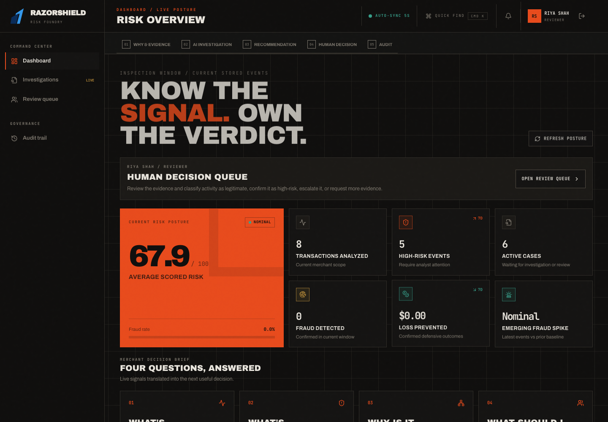

# RazorShield AI

**Detect. Investigate. Explain. Protect.**

RazorShield AI is a defense-only merchant risk operations demo for Razorpay Buildathon Track 02. It joins authenticated merchant operations, trained/versioned risk models, explainable scoring, graph signals, returns and chargeback support, bounded investigation, human review, and audit history in one working application.

> Data and metrics in the bundled demo are **synthetic**. A risk score is decision support, not proof of fraud. The agent cannot execute financial actions.

## Buildathon submission kit

### Risk-operations upgrade

New **Risk simulator** and **Risk operations** navigation adds non-saving what-if experiments,
counterfactual sensitivity, model health/drift, threshold/capacity/business-cost analysis and admin property tests.
Each investigation now has an evidence timeline, prior-only behavioral fingerprint, human-versus-model feedback
and data-to-decision replay. See the [technical decision log](docs/decisions.md) and
[what broke / how we fixed it](docs/failures-and-fixes.md).

The latest [five-minute recording script](docs/submission/RISK_OPERATIONS_NARRATION.md) starts at authentication,
uses the original synthetic voice and has **no bottom narration captions**. New operations tests run with the
ordinary browser suite; paced recording is explicitly opt-in. No ML artifacts or live merchant datasets are changed.

Start with the [submission checklist](docs/submission/README.md),
[authentication-first live tour and own-voice narration](docs/submission/LIVE_TOUR_NARRATION.md), and
[12-field application answer sheet](docs/submission/APPLICATION_ANSWERS.md).
The ordinary demo and real-data candidate are deliberately distinguished in the
[reproducible evaluation report](docs/EVALUATION.md). Public deployment is not
part of this local demo's acceptance claim.



See the [sender/receiver evidence capture](docs/submission/screenshots/sender-receiver.png).

## Run locally

Requirements: Python 3.12 recommended (3.11+ supported by the project), Node 22+, pnpm 10+.
Run these commands from the repository root. The backend reads `.env` from its working directory.

```bash
cp .env.example backend/.env
python3 -m venv backend/.venv
backend/.venv/bin/python -m pip install -e './backend[dev]'
pnpm install --frozen-lockfile
cd backend
.venv/bin/python -m alembic upgrade head
.venv/bin/python -m uvicorn app.main:app --reload --port 5001
```

In a second terminal:

```bash
pnpm --filter @workspace/razorshield-ai dev
```

Open `http://localhost:5173` and use one of the role-specific demo accounts:

| Role         | Email                       | Phone             | Password                     |
| ------------ | --------------------------- | ----------------- | ---------------------------- |
| Admin        | `admin@razorshield.demo`    | `+91 91000 00201` | `Admin-RazorShield-2026!`    |
| Risk analyst | `analyst@razorshield.demo`  | `+91 91000 00202` | `Analyst-RazorShield-2026!`  |
| Reviewer     | `reviewer@razorshield.demo` | `+91 91000 00203` | `Reviewer-RazorShield-2026!` |
| Viewer       | `viewer@razorshield.demo`   | `+91 91000 00204` | `Viewer-RazorShield-2026!`   |

These are intentionally public **local-demo-only credentials**. Never deploy these accounts or demo secrets publicly. All four users belong to the same demo merchant, so they share merchant data while navigation, actions, and dashboard guidance follow each account's role.

The operator UI includes dashboard, searchable transaction ledger, a dedicated CSV/JSON Dataset Analysis workspace, manual assessment, investigations, review queue, fraud intelligence, abuse network, return risk, chargebacks, global search, Customer 360, notifications, analytics, audit, model monitoring, and safety settings. A successful upload (up to 5,000 rows or 25 MB) becomes the active merchant dataset: every operational section switches to it atomically, while later real-time assessments join the same scope. Earlier data remains preserved without being mixed into current results. Labeled uploads can include `fraud_label` and `return_label`; an Admin may explicitly run one guarded training job per active dataset after minimum sample and class-balance checks. Upload never retrains automatically. Ready-to-upload examples are in `examples/transactions.csv` and `examples/transactions.json`.

## Docker

This Compose stack is a local development setup with public demo database credentials, not a production deployment. Production requires managed secrets, HTTPS, explicit CORS origins, disabled demo seeding, and infrastructure verification.

```bash
docker compose up --build
```

Open the UI at `http://localhost:5173`; API docs are at `http://localhost:8000/docs` in development.

## Verify

```bash
backend/.venv/bin/ruff format --check backend ml
backend/.venv/bin/ruff check backend ml
PYTHONPATH=backend:. backend/.venv/bin/python -m pytest backend/tests ml/tests
PYTHONPATH=backend:. backend/.venv/bin/python scripts/verify_submission_metrics.py --output outputs/submission/metrics.json
pnpm run typecheck:libs
pnpm --filter @workspace/razorshield-ai typecheck
pnpm --filter @workspace/razorshield-ai build
RAZORSHIELD_E2E_UI_PORT=5175 RAZORSHIELD_E2E_API_PORT=5003 pnpm --filter @workspace/razorshield-ai e2e
```

Browser tests create an isolated UUID-named SQLite database and never reuse a
running application server. Choose free ports; the optional
`RAZORSHIELD_E2E_RECORD=1` records a silent rehearsal in Playwright test results.
For real PostgreSQL regressions, set `RAZORSHIELD_POSTGRES_TEST_URL` to a disposable
test cluster with CREATEDB permission; see [migration verification](docs/verification/postgresql-enum-migration-2026-08-31.md).

See [architecture](docs/ARCHITECTURE.md), [API](docs/API.md), [model card](docs/MODEL_CARD.md), and [deployment](docs/DEPLOYMENT.md).

## Complete sender/receiver dataset test

Upload [examples/complete-party-details.csv](examples/complete-party-details.csv) in **Dataset analysis**. It contains 24 synthetic records and 48 columns: transaction/customer IDs; sender/receiver names, contacts, account references, banks and IFSCs; verification, payment, time, device, location, behavioral, velocity, graph, and outcome fields.

Open `FULL-TX-0002` using **Inspect** to see Diya Patel → Rapid Digital Exchange, INR 66,700, both account references and supporting evidence. All names, emails, phones and account references are fabricated for testing. Do not use them to contact anyone or initiate payments. The upload activates a new dataset without deleting previous datasets. It does not train models or execute financial actions.

The automated round-trip test checks every party field across all 24 investigations and verifies dashboard counts, labels, dataset scope, and prior-only investigation history. See [the dated verification report](docs/verification/complete-party-dataset-2026-08-31.md) for measured results and limitations. Twenty-four hand-crafted records are not sufficient training or production evaluation data.

## Architecture and repository map

```text
Merchant login → API/manual/CSV ingestion → validation + schema adaptation
  → fraud / anomaly / behavior / velocity / graph / rules → risk fusion
  → score + evidence → bounded investigation + policy retrieval
  → human review → recorded decision + audit → monitoring
```

| Location | Purpose |
| --- | --- |
| `artifacts/razorshield-ai/` | React + TypeScript + Vite operator interface and browser tests |
| `backend/app/` | FastAPI, SQLAlchemy, authentication, risk engines and workflows |
| `backend/migrations/` | Alembic SQLite/PostgreSQL schema migrations |
| `backend/tests/`, `ml/tests/` | API, tenant isolation, security, model and governance checks |
| `ml/training/`, `ml/artifacts/` | Reproducible training code, synthetic demo models, manifests and candidate reports |
| `lib/api-client-react/` | Shared client contracts and types |
| `examples/` | Synthetic API and dataset examples |
| `docs/`, `.github/workflows/` | Architecture, safety, evaluation, deployment notes and CI |

The inherited `artifacts/api-server` and `artifacts/mockup-sandbox` workspaces are not the production RazorShield API/UI. Use the FastAPI backend and `@workspace/razorshield-ai` commands above. The unrelated mockup templates currently have TypeScript errors under the all-workspace `pnpm run typecheck`; the scoped application and shared-library checks above are the relevant verification commands.

## Model and production boundaries

- Bundled contextual fraud/fusion models use synthetic data. Names/contact information are evidence fields, not claims of identity verification or fraud-model accuracy.
- Anomaly is not proof of fraud. Return risk and chargeback assistance are separate workflows. A high-risk score recommends human review; it never automatically blocks, refunds or transfers money.
- The default investigator is deterministic, bounded orchestration with lexical policy retrieval. Configuration placeholders do not constitute a deployed production LLM/RAG or managed-secret integration.
- IEEE-CIS training code and aggregate candidate reports are included. Raw competition datasets and derived candidate `.pkl` binaries are intentionally excluded pending redistribution/licensing review. Obtain authorized inputs and use [the real-data pipeline](docs/REAL_ML_PIPELINE.md) to train/package them locally. The optional candidate API fails closed with HTTP 503 when binaries are absent; two artifact-dependent SHAP/inference tests are explicitly skipped in a public checkout.
- Do not load model pickle/joblib files from untrusted sources. Candidate metadata alone does not satisfy artifact integrity or promotion gates. Business acceptance targets remain unmet; do not promote a model based only on the demo or this upload.
- Secrets, uploaded merchant databases, local environments, generated outputs and raw training data are excluded from version control. Supply your own providers and secrets for deployment.

For current evidence and unresolved gates, see [deployment readiness](docs/DEPLOYMENT_READINESS.md), [security](docs/SECURITY.md), and [evaluation](docs/EVALUATION.md). Historical reports are dated snapshots, not a guarantee of current production readiness.
